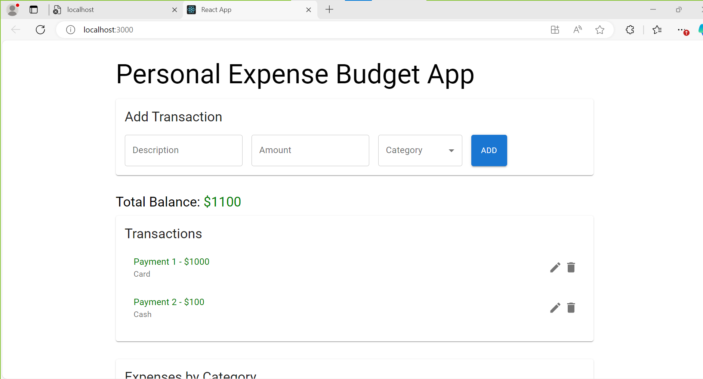
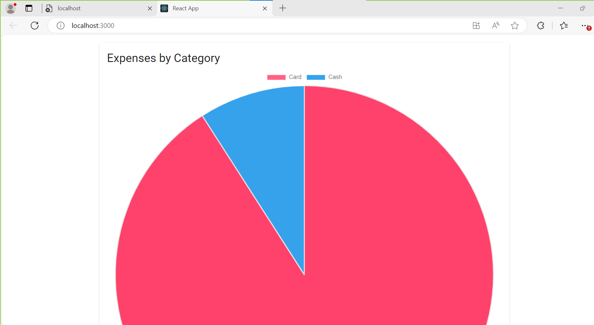
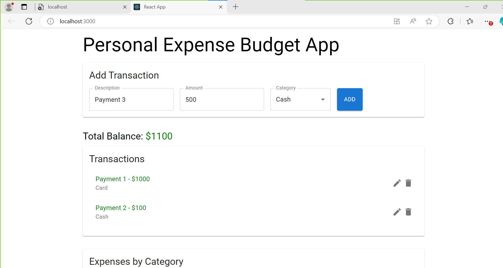

# Personal Budget App
## built with React (frontend) and ASP.NET (backend).  
## This project is for learning and portfolio purposes only.

A fullstack Budget web application with CRUD functions (Create, Read, Update, Delete) for managing transactions. RESTful API were developed using ASP.NET Core and Axios is used to connect React frontend. Entity Framework Core is used with SQLite for database operations and Swagger for API documentation.

## Features
- Add, edit, and delete transactions
- Track entered expenses by category
- Responsive UI

## Technologies
- Frontend: React, Material-UI
- Backend: ASP.NET Web API
- Database: SQLite

## Technical Skills
#### Programming Languages: C#, JavaScript
#### Frameworks:ASP.NET Core, React
#### Databases:SQLite, Entity Framework Core
#### Tools:Git, GitHub, Swagger (OpenAPI), VS Code
#### Concepts:RESTful APIs,CRUD operations,MVC architecture

## Application Screenshots

## Disclaimer
This is a **personal project**. No real banking or personal data is used.  
Do **not** use it for real financial transactions.  

## Usage
1. Clone the repo
2. Install dependencies
3. Run frontend and backend locally

 

